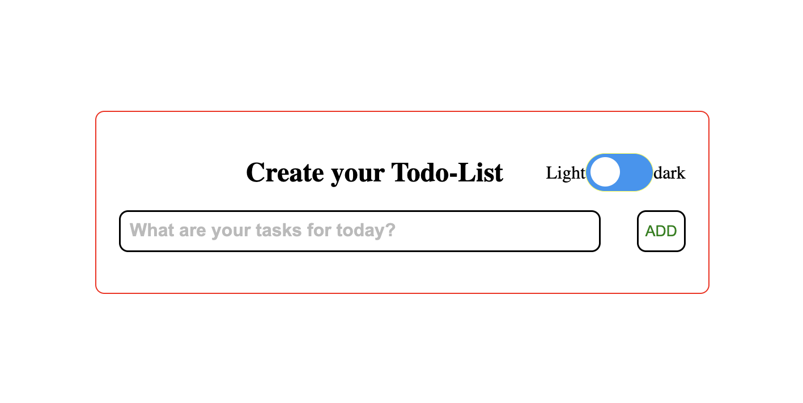
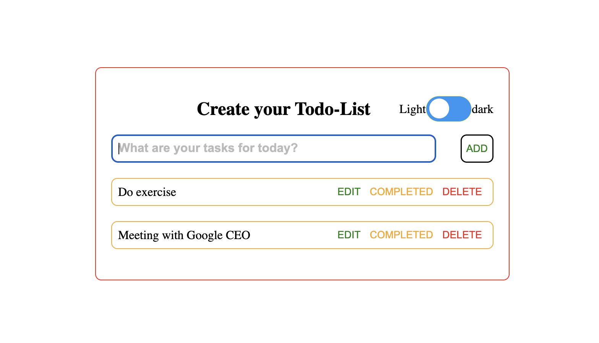
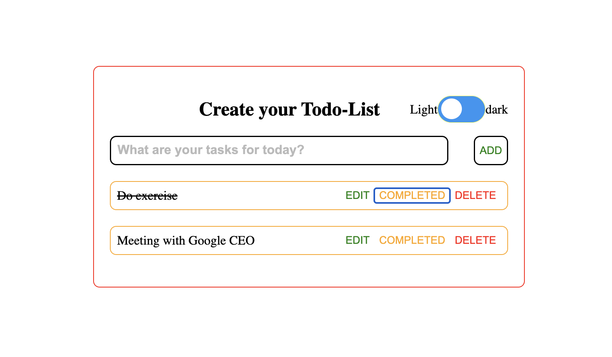
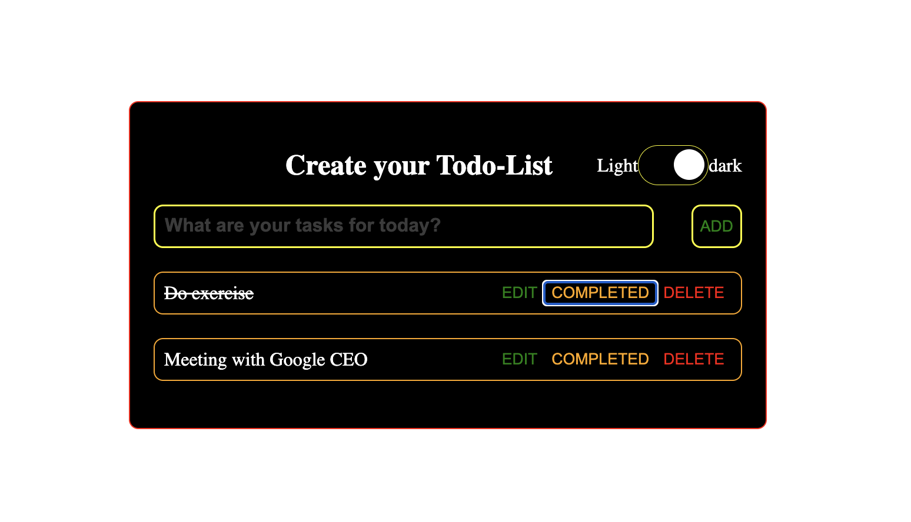

# Todo_List

Hi 👋,
Welcome to the Todo list repository!
A simple todo list application for adding tasks with functionality of Edit, mark task as completed and delete the task.

This project has been developed with the use of <b>HTML5</b>, <b>CSS3</b> and <b>Vanilla JavaScript</b>.

#### todo list Screenshots

<table>
  <tr>
    <td>Home Page (light mode)</td>
     <td>Home Page (dark mode)</td>
  </tr>
  <tr>
    <td></td>
    <td></td>
  </tr>
 </table>
 <table>
  <tr>
    <td>Screen with tasks added (light mode)</td>
     <td>Screen with tasks added (dark mode)</td>
  </tr>
  <tr>
    <td></td>
    <td></td>
  </tr>
 </table>
 <table>
  <tr>
    <td>Task marked completed (light mode)</td>
    <td>Task marked completed (dark mode)</td>
  </tr>
  <tr>
    <td></td>
    <td></td>
  </tr>
 </table>
